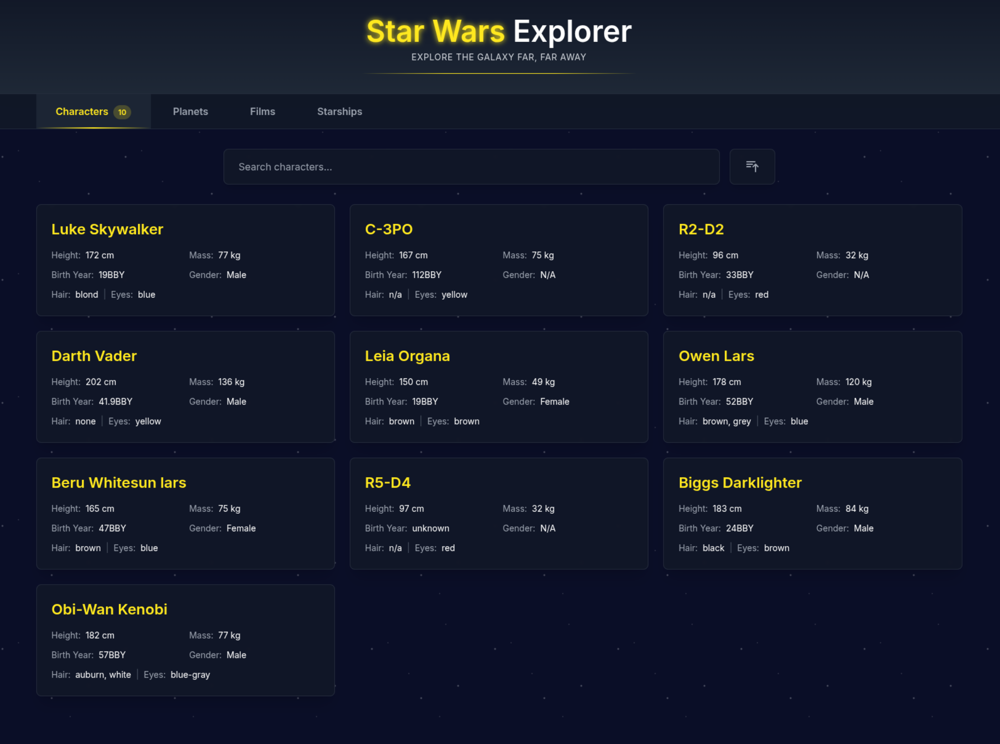
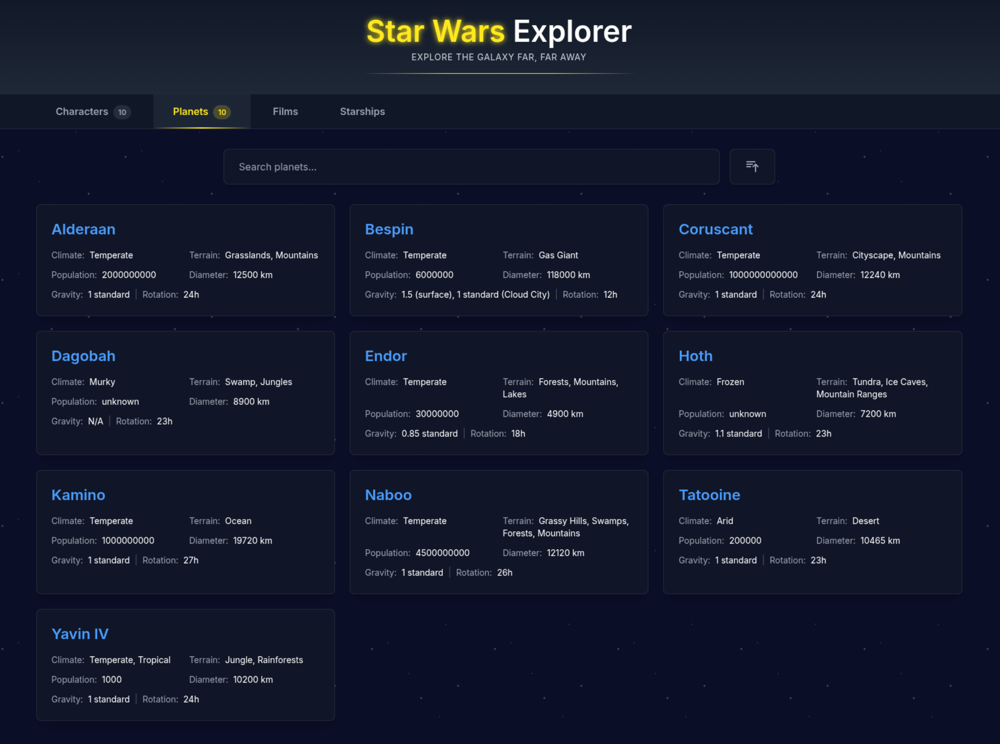
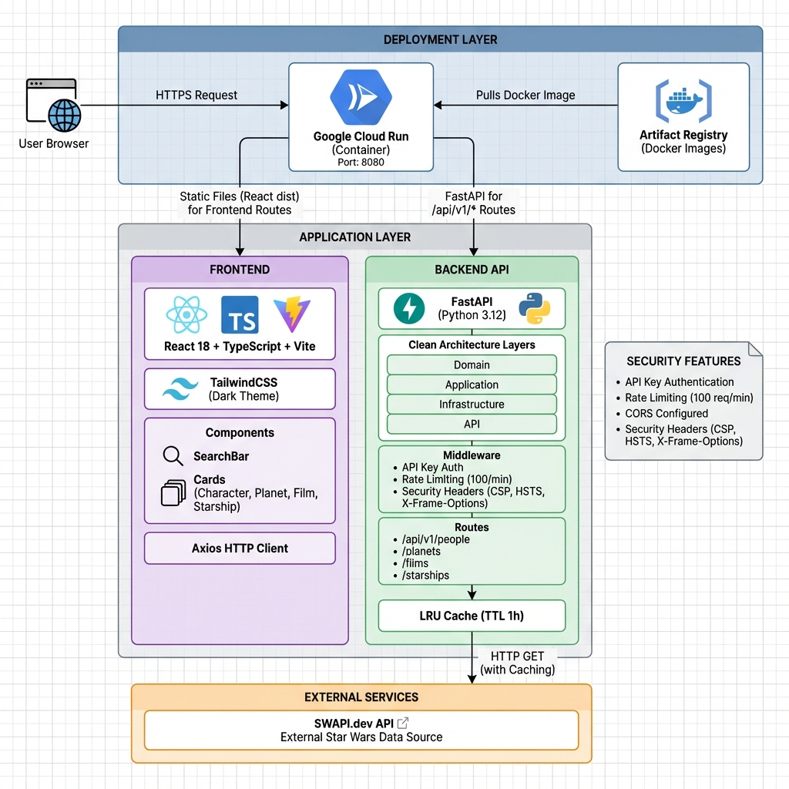

# ⭐ Star Wars API Platform

[](https://www.python.org/)
[](https://fastapi.tiangolo.com/)
[](https://reactjs.org/)
[](https://www.typescriptlang.org/)
[](./backend/htmlcov/index.html)
[](https://github.com/CFBruna/starwars-gcp-explorer/actions)

> 🚀 **Production Live Demo:** [api.brunadev.com](https://api.brunadev.com)  
> 📖 **API Documentation:** [Swagger UI](https://api.brunadev.com/api/v1/docs) | [ReDoc](https://api.brunadev.com/api/v1/redoc)  
> 🏥 **Health Check:** [api.brunadev.com/health](https://api.brunadev.com/health)

A serverless API platform built on **Google Cloud Run** that integrates with SWAPI to deliver an interactive web experience for exploring the Star Wars universe.

## 📸 Screenshots

### Characters Explorer
[](https://api.brunadev.com/)

### Planets Explorer
[](https://api.brunadev.com/)

## 🏗️ Architecture

[](docs/architecture.md)

**Modular Monolith** approach combining backend API and frontend SPA in a single Cloud Run deployment. See detailed [architecture documentation](docs/architecture.md).

## ✨ Key Features

- 🔐 **Secure:** API Key authentication + Rate limiting (100 req/min)
- 🎨 **Modern UI:** React 19 + TypeScript + TailwindCSS dark theme
- 🧪 **Well-Tested:** 86% backend coverage, 92% frontend coverage
- ⚡ **Fast:** LRU caching (1h TTL) + async HTTP
- 🏛️ **Clean Architecture:** Domain-driven design (DDD)
- 🚀 **Production-Ready:** Security headers, CORS, structured logging
- 📱 **Responsive:** Mobile-friendly design

## 🚀 Quick Start

### Prerequisites

- Python 3.12+
- Node.js 20+ and pnpm
- Docker (for deployment)
- Google Cloud SDK (for Cloud Run deployment)

### Local Development

**1. Backend Setup:**

```bash
cd backend

# Install dependencies with uv
uv sync

# Start development server
uv run uvicorn src.main:app --reload
```

Backend will run on: `http://localhost:8000`
- API Docs (Swagger): `http://localhost:8000/api/v1/docs`
- Health Check: `http://localhost:8000/health`

**2. Frontend Setup:**

```bash
cd frontend

# Install dependencies
pnpm install

# Start development server
pnpm dev
```

Frontend will run on: `http://localhost:5173`

### Environment Variables

Create `backend/.env` file:

```env
# API Configuration
API_KEY=your-secure-api-key-here
ENVIRONMENT=development

# SWAPI Integration
SWAPI_BASE_URL=https://swapi.dev/api
CACHE_TTL_SECONDS=3600

# Security
RATE_LIMIT=100/minute
CORS_ORIGINS=*
```

**Generate a secure API key:**

```bash
python scripts/generate_api_key.py
```

Create `frontend/.env` file:

```env
VITE_API_URL=http://localhost:8000
VITE_API_KEY=your-api-key-here
```

## 🐳 Docker Deployment

**Build:**

```bash
docker build -t starwars-api .
```

**Run:**

```bash
docker run -p 8080:8080 \
  -e API_KEY=your-secure-key \
  -e ENVIRONMENT=production \
  -e CORS_ORIGINS=https://your-domain.com \
  starwars-api
```

Access: `http://localhost:8080`

## 🧪 Testing

**Backend Tests (37 tests, 86% coverage):**

```bash
cd backend

# Run all tests
uv run pytest

# With coverage report
uv run pytest --cov --cov-report=term-missing
```

**Frontend Tests (76 tests, 92% coverage):**

```bash
cd frontend

# Run tests
pnpm test

# With coverage
pnpm test:coverage
```

**Linting & Type Checking:**

```bash
# Backend
cd backend
uv run ruff check .
uv run mypy src/

# Frontend
cd frontend
pnpm lint
```

## 📊 API Endpoints

| Endpoint | Method | Description | Auth Required | Query Params |
|----------|--------|-------------|---------------|--------------|
| `/health` | GET | Health check | ❌ No | - |
| `/api/v1/people` | GET | List characters | ✅ Yes | `search`, `ordering`, `page` |
| `/api/v1/planets` | GET | List planets | ✅ Yes | `search`, `ordering`, `page` |
| `/api/v1/films` | GET | List films | ✅ Yes | `page` |
| `/api/v1/starships` | GET | List starships | ✅ Yes | `search`, `ordering`, `page` |

### Authentication

All `/api/v1/*` endpoints require the `X-API-Key` header:

```bash
curl -H "X-API-Key: your-api-key" \
  http://localhost:8000/api/v1/people?search=Luke
```

### Ordering

Use `?ordering=field` for ascending or `?ordering=-field` for descending:

```bash
# Sort by name A-Z
/api/v1/people?ordering=name

# Sort by height (tallest first)
/api/v1/people?ordering=-height

# Planets by population (highest first)
/api/v1/planets?ordering=-population
```

**Available fields:** `name`, `height`, `mass`, `diameter`, `population`, `crew`, `passengers`

See [API Examples](docs/api-examples.md) for more detailed usage.

## 🚀 Cloud Run Deployment

See [Deployment Guide](docs/DEPLOYMENT.md) for step-by-step instructions.

**Quick deploy:**

```bash
# 1. Build and push to Artifact Registry
gcloud builds submit --tag us-central1-docker.pkg.dev/PROJECT_ID/starwars-api/app

# 2. Deploy to Cloud Run
gcloud run deploy starwars-api \
  --image us-central1-docker.pkg.dev/PROJECT_ID/starwars-api/app \
  --platform managed \
  --region us-central1 \
  --allow-unauthenticated \
  --set-env-vars="API_KEY=$(python scripts/generate_api_key.py | tail -1),ENVIRONMENT=production,CORS_ORIGINS=*"
```

## 📁 Project Structure

```
starwars-gcp-explorer/
├── backend/                    # FastAPI Backend
│   ├── src/
│   │   ├── domain/            # Business entities (Character, Planet, etc)
│   │   ├── application/       # Use cases and ports
│   │   ├── infrastructure/    # SWAPI client, caching
│   │   ├── api/               # Controllers, middleware, routes
│   │   └── core/              # Configuration
│   ├── tests/
│   │   ├── unit/              # Unit tests
│   │   └── integration/       # API integration tests
│   ├── Dockerfile
│   └── pyproject.toml
├── frontend/                   # React Frontend
│   ├── src/
│   │   ├── components/        # React components
│   │   ├── services/          # API client
│   │   ├── types/             # TypeScript interfaces
│   │   └── test/              # Vitest tests
│   ├── vite.config.ts
│   └── package.json
├── docs/                       # Documentation
│   ├── architecture.md         # System design + Mermaid diagrams
│   ├── api-examples.md         # cURL examples
│   └── DEPLOYMENT.md           # Cloud Run deployment guide
├── scripts/
│   └── generate_api_key.py     # Secure key generator
├── .github/workflows/
│   └── ci-cd.yml               # Automated testing + deployment
└── Makefile                    # Development commands
```

## 🛠️ Tech Stack

### Backend
- **Python 3.12** - Modern async features
- **FastAPI** - High-performance async framework
- **httpx** - Async HTTP client for SWAPI
- **Pydantic 2.0** - Data validation
- **pytest** - Testing framework
- **ruff + mypy** - Linting and type checking

### Frontend
- **React 19** - UI library
- **TypeScript 5** - Type safety
- **Vite 7** - Fast build tool
- **TailwindCSS 3** - Utility-first CSS
- **Vitest** - Fast unit testing
- **Axios** - HTTP client

### DevOps
- **Docker** - Multi-stage builds
- **GitHub Actions** - CI/CD pipeline
- **Google Cloud Run** - Serverless deployment
- **Artifact Registry** - Container storage

## 🏆 Production Features

- ✅ **Security Headers:** CSP, HSTS, X-Frame-Options, X-XSS-Protection
- ✅ **CORS Configuration:** Environment-based origin control
- ✅ **Structured Logging:** JSON format for Cloud Logging
- ✅ **Rate Limiting:** 100 requests/minute per IP
- ✅ **API Key Authentication:** Custom middleware
- ✅ **LRU Caching:** 1-hour TTL for SWAPI responses
- ✅ **Health Checks:** Readiness and liveness endpoints
- ✅ **Environment Management:** Development vs Production configs

## 📚 Documentation

- [📐 Architecture & Design](docs/architecture.md) - System design, Mermaid diagrams, tech decisions
- [📖 API Usage Examples](docs/api-examples.md) - cURL examples, common queries
- [🚀 Deployment Guide](docs/DEPLOYMENT.md) - Step-by-step Cloud Run deployment
- [🧪 SWAPI Documentation](https://swapi.dev/documentation) - External API reference

## 🤝 Contributing

1. Fork the repository
2. Create a feature branch (`git checkout -b feature/amazing-feature`)
3. Commit changes (`git commit -m 'feat: add amazing feature'`)
4. Push to branch (`git push origin feature/amazing-feature`)
5. Open a Pull Request

## 📄 License

This project is licensed under the MIT License - see the [LICENSE](LICENSE) file for details.

---

**Developed by:** [Bruna Menezes](https://github.com/CFBruna)  
**Live Demo:** [api.brunadev.com](https://api.brunadev.com)  
**Portfolio:** [brunadev.com](https://brunadev.com)

