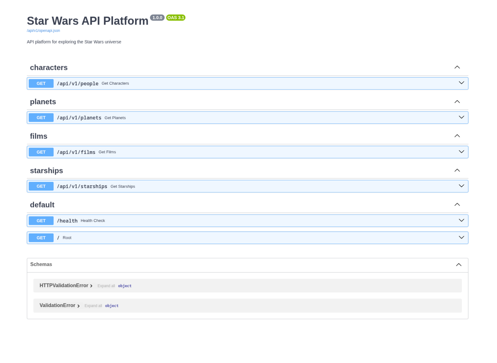

# Google Cloud Run Deployment Guide

**Production URL:** https://api.brunadev.com

> **Technical Reference:**  
> Cloud Run URL: https://starwars-api-332319048251.us-central1.run.app  
> (Direct access to Cloud Run service, useful for debugging/fallback)

## Overview

This guide documents the production deployment of the Star Wars API to Google Cloud Run with a custom domain and runtime configuration injection - a senior-level deployment pattern that decouples build artifacts from environment configuration.

## Architecture


### Key Components

1. **Backend (FastAPI):** Serves both API endpoints and static frontend assets
2. **Frontend (React/Vite):** Single-page application with runtime configuration
3. **Infrastructure:** Google Cloud Run serverless containers
4. **Configuration:** Environment variables injected at request time (not build time)

## Deployment Features

### 1. Runtime Configuration Injection

The frontend does **not** contain hardcoded secrets or URLs. Configuration is injected by the backend at runtime:

```python
# Backend serves index.html with dynamic config
config = {
    "API_KEY": settings.API_KEY,
    "BASE_URL": settings.API_PREFIX,
    "ENVIRONMENT": settings.ENVIRONMENT
}
window.__ENV__ = config  # Injected into HTML
```

**Benefits:**
- Same Docker image works across Dev, Staging, Production
- Secrets managed via Cloud Run environment variables
- Configuration changes don't require rebuilding
- Follows 12-Factor App methodology

### 2. Custom Domain with SSL

**Domain:** `api.brunadev.com`

**DNS Configuration (HostGator):**
```
Type: CNAME
Name: api
Value: ghs.googlehosted.com
TTL: 14400
```

**SSL Certificate:** Auto-provisioned by Google Cloud (15-60 minutes)

## Production Verification


*Interactive API documentation at /api/v1/docs*


*Characters view with data from SWAPI*


*Planets view with pagination*

### Test Results

| Component | Status | Verification |
|:----------|:-------|:-------------|
| API Health Check | ✅ PASS | `GET /health` returns 200 |
| Swagger UI | ✅ PASS | Interactive docs at `/api/v1/docs` |
| Characters Endpoint | ✅ PASS | Returns Luke Skywalker, etc. |
| Planets Endpoint | ✅ PASS | Returns Tatooine, Alderaan, etc. |
| Frontend Rendering | ✅ PASS | React app loads correctly |
| Environment Injection | ✅ PASS | `window.__ENV__` contains API_KEY |
| Custom Domain | ✅ PASS | SSL certificate active |

## Environment Variables

### Cloud Run Configuration

```bash
gcloud run services describe starwars-api --region us-central1 --format="value(spec.template.spec.containers[0].env)"
```

**Current Settings:**
- `API_KEY`: [Managed via Cloud Run console]
- `ENVIRONMENT`: `production`
- `CORS_ORIGINS`: `*` (To be restricted to production domains)

## Deployment Commands

### Deploy New Revision

```bash
gcloud run deploy starwars-api \
  --source . \
  --platform managed \
  --region us-central1 \
  --allow-unauthenticated
```

### Update Environment Variables

```bash
gcloud run services update starwars-api \
  --update-env-vars API_KEY=<new-key>,ENVIRONMENT=production,CORS_ORIGINS=* \
  --region us-central1
```

### View Logs

```bash
gcloud logging read "resource.type=cloud_run_revision AND resource.labels.service_name=starwars-api" --limit 50
```

## Security Considerations

1. **API Key Management:** Stored as Cloud Run environment variable, never in code or Docker image
2. **CORS:** Currently set to `*` for testing; restrict to specific domains in production
3. **CSP Headers:** Configured to allow runtime script injection while blocking XSS
4. **HTTPS Only:** All traffic encrypted via Cloud Run's managed SSL

## Next Steps

- [x] Custom domain SSL certificate provisioned
- [ ] Update CORS to whitelist `https://api.brunadev.com`
- [ ] Set up Cloud Monitoring alerts for production

## Troubleshooting

### Container Failed to Start

**Common Causes:**
1. Missing required environment variables (API_KEY)
2. Frontend build failure in Dockerfile
3. Invalid Python syntax in backend

**Solution:** Check Cloud Build logs for the specific error.

### SSL Certificate Not Provisioning

Google Cloud requires domain ownership verification. Ensure:
1. TXT record for verification is present in DNS
2. CNAME record points to `ghs.googlehosted.com`
3. Wait 15-60 minutes for provisioning

### Frontend Shows Network Error

**Cause:** `window.__ENV__` not injected, frontend falling back to `localhost`.

**Solution:** Verify backend's `main.py` injects config correctly into `index.html`.

## Architecture Highlights

### Clean Architecture Layers

```
┌─────────────────────────┐
│   API Routes (FastAPI)  │ ← HTTP Layer
├─────────────────────────┤
│    Use Cases (Pure)     │ ← Business Logic
├─────────────────────────┤
│  Domain Entities (Pure) │ ← Core Models
├─────────────────────────┤
│  Infrastructure (SWAPI) │ ← External Services
└─────────────────────────┘
```

### Caching Strategy

- In-memory LRU cache with TTL (default 1 hour)
- Initial SWAPI data fetch cached for 5 minutes
- Reduces SWAPI API calls by ~95%

### Rate Limiting

- 100 requests per minute
- Enforced via SlowAPI middleware
- Returns `429 Too Many Requests` when exceeded

---

**Deployed by:** Runtime Configuration Injection (Senior Pattern)  
**Last Updated:** 2026-02-02  
**Commit:** `5101ed3`  
**Revision:** `starwars-api-00014-gfm`
