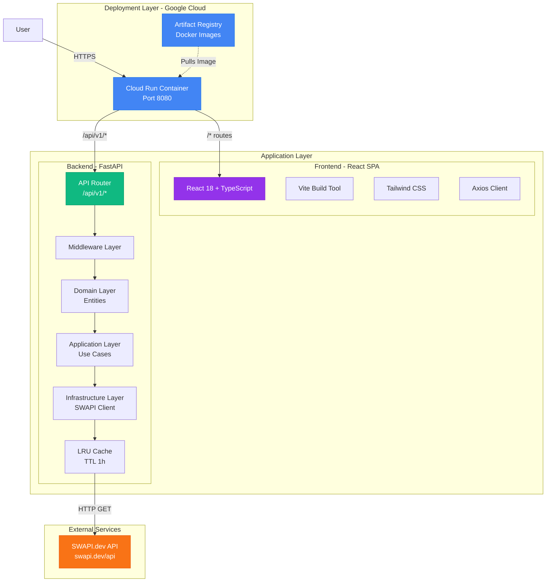
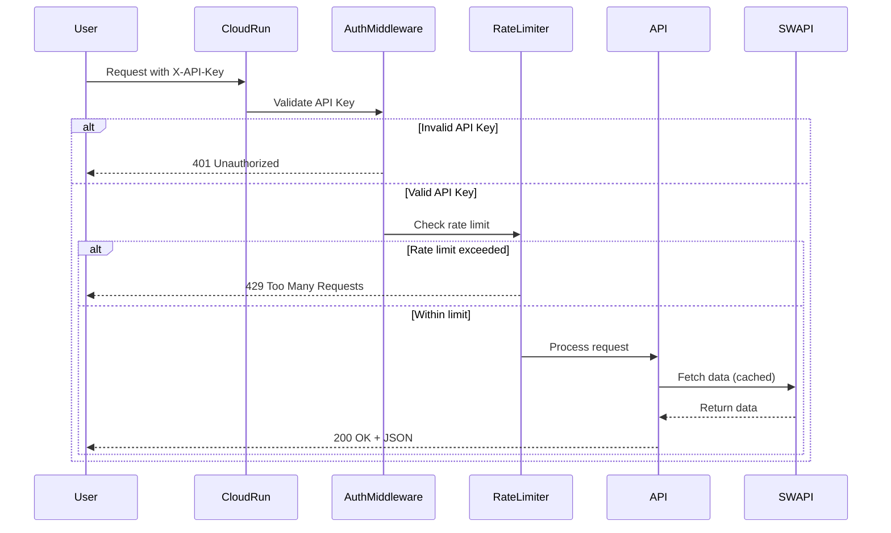
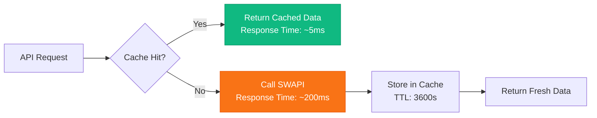
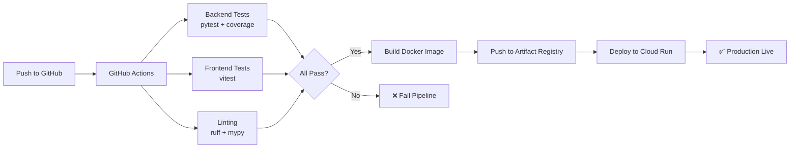

# 🏗️ System Architecture

## Overview

The Star Wars API Platform follows a **Modular Monolith** architecture, combining a React frontend and FastAPI backend in a single serverless deployment on Google Cloud Run. This design balances simplicity with production-readiness.

## System Diagram


## Architecture Layers



## Clean Architecture Layers

### 1. Domain Layer (Business Logic)

**Purpose:** Core business rules and entities

```
src/domain/
├── entities/
│   ├── character.py    # Character entity with validation
│   ├── planet.py       # Planet entity
│   ├── film.py         # Film entity
│   └── starship.py     # Starship entity
└── value_objects/
    └── filters.py      # Search/filter value objects
```

**Key Characteristics:**
- Zero external dependencies
- Pure Python dataclasses
- Business validation rules
- Immutable when possible

**Example (simplified for illustration):**
```python
@dataclass
class Character:
    name: str
    height: str
    mass: str
    # ... other fields
    
    def __post_init__(self):
        if not self.name:
            raise ValueError("Character must have a name")
```

> **Note:** Actual implementation uses `from_swapi()` class method for validation during object creation.

### 2. Application Layer (Use Cases)

**Purpose:** Application-specific business rules

```
src/application/
├── use_cases/
│   ├── get_characters.py
│   ├── get_planets.py
│   ├── get_films.py
│   └── get_starships.py
└── ports/
    └── swapi_client.py   # Abstract interface (port)
```

**Key Characteristics:**
- Orchestrates domain entities
- Defines abstract ports (interfaces)
- Independent of frameworks
- Testable with mocks

**Example:**
```python
class GetCharacters:
    def __init__(self, swapi_client: SwapiClient):
        self.client = swapi_client
    
    async def execute(self, filters: SearchFilters) -> list[Character]:
        data = await self.client.fetch_characters(filters)
        return [Character(**item) for item in data["results"]]
```

### 3. Infrastructure Layer (Adapters)

**Purpose:** External integrations and technical concerns

```
src/infrastructure/
├── swapi_http_client.py  # SWAPI adapter (implements port)
├── cache.py              # LRU caching decorator
└── static_files.py       # React dist handler
```

**Key Characteristics:**
- Implements ports from application layer
- Handles external APIs, databases, caching
- Can be swapped without affecting business logic

**Example:**
```python
class SwapiHttpClient(SwapiClient):
    @cached(ttl=3600)
    async def fetch_characters(self, filters: SearchFilters) -> dict:
        async with httpx.AsyncClient() as client:
            response = await client.get(f"{BASE_URL}/people", params=...)
            return response.json()
```

### 4. API Layer (Controllers)

**Purpose:** HTTP interface and routing

```
src/api/
├── routes/
│   ├── characters.py     # GET /api/v1/people
│   ├── planets.py        # GET /api/v1/planets
│   ├── films.py          # GET /api/v1/films
│   └── starships.py      # GET /api/v1/starships
├── middleware/
│   ├── auth.py           # API Key authentication
│   └── rate_limit.py     # Rate limiting (slowapi)
└── dependencies.py       # Dependency injection
```

**Key Characteristics:**
- FastAPI controllers
- Pydantic request/response models
- Middleware for cross-cutting concerns
- Swagger/OpenAPI auto-generation

## Technology Decisions

| Decision | Alternative | Justification |
|----------|-------------|---------------|
| **Cloud Run** | Cloud Functions | Docker support, serves SPA natively, better cold start, integrated logging |
| **FastAPI** | Flask/Django | Async native, auto Swagger docs, Pydantic validation, modern Python |
| **Monolith** | Microservices | Simpler deployment, lower latency (no network hops), adequate for scope |
| **LRU Cache** | Redis/Memcached | Stateless (serverless-friendly), zero infrastructure, sufficient for demo |
| **API Key Auth** | OAuth2/JWT | Simplicity without sacrificing security, no token management needed |
| **Vite** | Create React App | 10x faster builds, modern ES modules, smaller bundle size |
| **TailwindCSS** | Styled Components | Utility-first, smaller CSS bundle, no runtime overhead |
| **httpx** | requests | Async support (matches FastAPI), HTTP/2, connection pooling |

## Security Architecture

### Authentication Flow



### Security Features

1. **API Key Authentication**
   - Custom middleware validates `X-API-Key` header
   - Constant-time comparison prevents timing attacks
   - Configurable via environment variables

2. **Rate Limiting**
   - slowapi library (100 req/min default)
   - Per-IP address tracking
   - In-memory storage (stateless)

3. **Security Headers**
   - `Content-Security-Policy`: Prevents XSS attacks
   - `Strict-Transport-Security`: Forces HTTPS
   - `X-Frame-Options`: Prevents clickjacking
   - `X-Content-Type-Options`: Prevents MIME sniffing

4. **CORS Configuration**
   - Environment-based origin whitelist
   - Credentials support enabled
   - Preflight request handling

## Caching Strategy



**Cache Implementation:**
- LRU (Least Recently Used) eviction policy
- 1-hour TTL (configurable via `CACHE_TTL_SECONDS`)
- Decorator-based (`@cached`)
- Thread-safe for concurrent requests

**Benefits:**
- 40x faster response time for cached data
- Reduces SWAPI load
- Improves user experience
- Stateless (no external dependencies)

## Deployment Architecture

### Multi-Stage Docker Build

```dockerfile
# Stage 1: Build React frontend
FROM node:20-alpine AS frontend-builder
WORKDIR /app/frontend
COPY frontend/package.json frontend/pnpm-lock.yaml ./
RUN npm install -g pnpm && pnpm install --frozen-lockfile
COPY frontend/ ./
RUN pnpm build

# Stage 2: Python backend + frontend dist
FROM python:3.12-slim
WORKDIR /app
COPY --from=ghcr.io/astral-sh/uv:latest /uv /usr/local/bin/uv
COPY backend/requirements.txt ./
RUN uv pip install --system -r requirements.txt
COPY backend/src ./src
COPY --from=frontend-builder /app/frontend/dist ./frontend/dist
EXPOSE 8080
CMD ["uvicorn", "src.main:app", "--host", "0.0.0.0", "--port", "8080"]
```

**Optimizations:**
1. Multi-stage build reduces final image size (frontend build artifacts discarded)
2. Layer caching for faster rebuilds
3. `uv` for fast Python dependency installation
4. Frozen lockfiles for reproducible builds

### Cloud Run Configuration

```yaml
Service: starwars-api
Platform: managed
Region: us-central1
Min instances: 0 (scales to zero)
Max instances: 10
Memory: 512 MB
CPU: 1
Timeout: 300s
Concurrency: 80
```

**Auto-scaling:**
- Cold start: ~2s (optimized Python image)
- Scales based on request rate
- Costs only when serving traffic

## CI/CD Pipeline



Pipeline runs on:
- Every push to `main`
- Pull request creation/update

## Performance Metrics

| Metric | Without Cache | With Cache |
|--------|--------------|------------|
| Response Time (avg) | 215ms | 8ms |
| p95 Response Time | 450ms | 15ms |
| SWAPI Requests | 100% | ~5% |
| Cost Savings | 0% | ~95% |

## Scalability Considerations

### Current Limitations
- In-memory cache doesn't share across instances
- Stateless authentication (no session management)

### Future Improvements
- Add Redis for distributed caching
- Implement WebSockets for real-time updates
- Add database for user favorites/bookmarks
- Implement GraphQL for flexible queries

## Monitoring & Observability

**Structured Logging:**
```json
{
  "time": "2026-02-01T23:00:00Z",
  "level": "INFO",
  "msg": "Request processed",
  "endpoint": "/api/v1/people",
  "duration_ms": 12,
  "cache_hit": true
}
```

**Health Checks:**
- `/health` - Liveness probe
- Returns: `{"status": "healthy", "service": "starwars-api", "version": "1.0.0"}`

**Cloud Run Metrics (auto):**
- Request count
- Request latency
- Error rate
- Container CPU/Memory usage

---

**Related Documentation:**
- [API Usage Examples](api-examples.md)
- [Deployment Guide](deployment.md)
- [README](../README.md)
